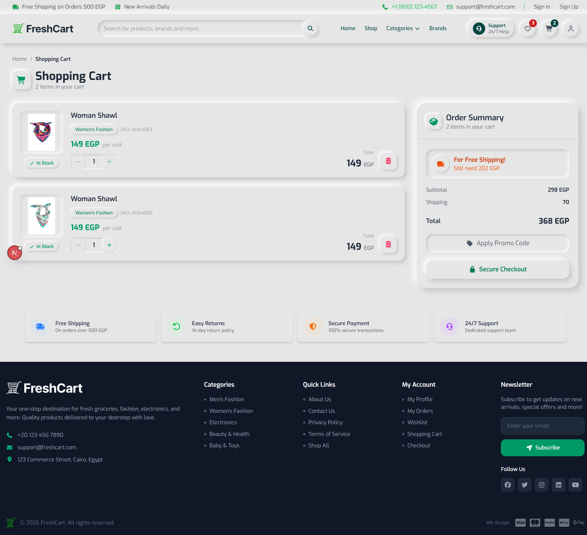
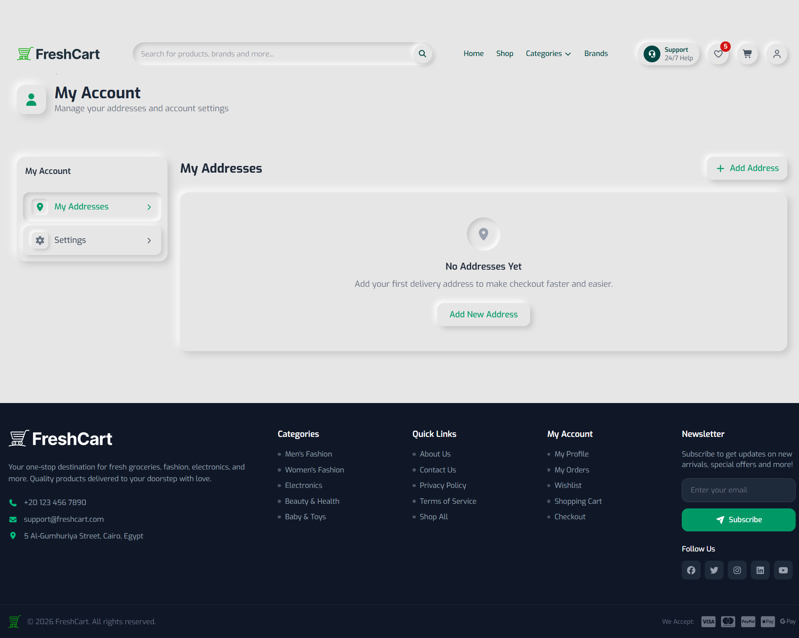
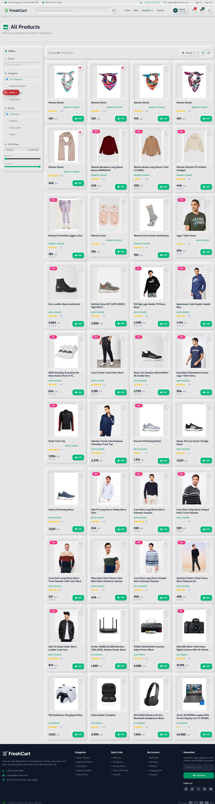

<div align="center">

# 🛒 FreshCart | E-Commerce Platform

A modern, full-featured e-commerce platform built with the latest web technologies to deliver a seamless and professional shopping experience for customers.

[](https://nextjs.org/)
[](https://www.typescriptlang.org/)
[](https://tailwindcss.com/)
[](https://redux-toolkit.js.org/)

[Live Demo](#) · [Report Bug](../../issues) · [Request Feature](../../issues)

</div>

---

## 📖 Table of Contents

- [About the Project](#-about-the-project)
- [Screenshots](#-screenshots)
- [Tech Stack](#️-tech-stack)
- [Main Features](#-main-features)
- [Main Pages & User Flows](#️-main-pages--user-flows)
- [Project Structure](#️-project-structure)
- [Getting Started](#-getting-started)
- [Environment Variables](#-environment-variables)
- [License](#-license)
- [Contact](#-contact)

---

## 📌 About the Project

FreshCart is a complete online store supporting all essential and advanced e-commerce operations — product browsing, cart management, orders, checkout, and account management — all wrapped in a modern, user-friendly interface.

The platform is designed to be flexible and scalable, with a focus on **performance**, **security**, and **user experience**, and fully supports all devices and screen sizes.

---

## 📸 Screenshots

> Add a few screenshots or a short GIF walkthrough here so visitors can see the product before reading further.

| Home | Cart | Profile | Wishlist | All-products
|------|------|---------|
|  |  |  |
  | 

---

## 🛠️ Tech Stack

| Category | Tools |
|---|---|
| **Framework** | [Next.js](https://nextjs.org/) — SSR/SSG/CSR, dynamic routing, API routes |
| **Language** | [TypeScript](https://www.typescriptlang.org/) — static typing for safer, more maintainable code |
| **Styling** | [TailwindCSS](https://tailwindcss.com/) — utility-first, responsive, modern UI |
| **Icons** | [Font Awesome](https://fontawesome.com/) |
| **Fonts** | Next.js Font Optimization (`next/font`) |
| **HTTP Client** | [Axios](https://axios-http.com/) |
| **Forms** | [React Hook Form](https://react-hook-form.com/) + [Zod](https://zod.dev/) for validation |
| **State Management** | [Redux Toolkit](https://redux-toolkit.js.org/) |
| **Notifications** | [React Toastify](https://fkhadra.github.io/react-toastify/) |
| **Animations** | [AOS](https://michalsnik.github.io/aos/) (Animate On Scroll) |
| **Code Quality** | ESLint, Prettier |
| **Build Tooling** | PostCSS |

Each tool was chosen deliberately to serve a specific purpose and deliver the best possible performance and developer experience.

---

## 🔥 Main Features

- 🔐 User authentication (sign up, login) with email verification and password reset
- 🔎 Browse products by categories and brands, with search and filtering
- 🖼️ Product details page with images, specs, reviews, and the ability to add a review
- 🛒 Cart management for both logged-in users and guests (with `localStorage` support)
- ❤️ Wishlist management for both logged-in users and guests
- 💳 Checkout process with order summary and payment
- 📦 Order tracking and detailed order history
- 👤 Profile management (edit info, change password)
- 📄 Static pages: About, Privacy Policy, Terms & Conditions, Contact Us
- 🔔 Interactive toast notifications for success/error states
- 🌐 Full Arabic support and a fully responsive design
- ⚡ High performance and fast page loads thanks to Next.js optimizations
- 🛡️ Protected routes for private pages (token-based auth)
- ✨ Rich user experience with scroll animations (AOS) and a modern design

---

## 🗺️ Main Pages & User Flows

| # | Page | Description |
|---|------|-------------|
| 1 | Home | Featured products, offers, categories, and brands |
| 2 | Categories | Browse products by category with filtering and search |
| 3 | Brands | View all brands and browse their products |
| 4 | Products | List all products with filtering and search options |
| 5 | Product Details | Product info, images, reviews, add to cart/wishlist |
| 6 | Cart | Manage cart items with edit and remove options |
| 7 | Wishlist | Save favorite products (logged-in users and guests) |
| 8 | Checkout | Order summary, shipping, and payment details |
| 9 | Orders | Order history and order details |
| 10 | Sign Up | Create a new account with email verification |
| 11 | Login | User login for registered users |
| 12 | Forget Password | Send a verification code to reset password |
| 13 | Reset Password | Enter a new password after verification |
| 14 | Verify Code | Enter the code sent to email for verification |
| 15 | Profile | Manage user info and change password |
| 16 | About | Project and team information |
| 17 | Privacy Policy | View the privacy policy |
| 18 | Terms | View terms and conditions |
| 19 | Contact | Contact form for support or inquiries |
| 20 | Not Found | Shown for invalid or non-existent routes |

**Basic user flow:**

1. Users can browse products without registration.
2. To purchase or add to a wishlist, users are prompted to sign up / log in.
3. After logging in, users can manage their cart, orders, profile, and wishlist.
4. All pages are mobile-friendly and easy to use.

---

## 🗂️ Project Structure

```
src/
├── app/            # Next.js App Router pages, organized by feature
│   ├── (authentication)/
│   ├── (dashboard)/
│   └── (platform)/
├── components/      # Shared UI components (Navbar, Footer, LoadingSpinner, etc.)
├── features/        # Each feature (auth, cart, products, wishlist, ...) with its
│                     # own components, screens, hooks, server actions, types, utils
├── store/           # Redux store setup and global state management
├── assets/          # Images and fonts used in the UI
├── styles/          # Global CSS, Tailwind, and AOS customizations
├── utils/           # Helper functions (e.g. cart/wishlist localStorage management)
├── lib/             # Helper libraries (e.g. Font Awesome setup)
└── config/          # Static or dynamic configuration files

public/               # Public assets like images and logos
package.json
tsconfig.json
next.config.ts
eslint.config.mjs
```

The project is organized for easy development, maintenance, and future scalability.

---

## 🚀 Getting Started

### Prerequisites

- Node.js (latest LTS recommended)
- npm or yarn

### Installation

```bash
git clone https://github.com/<your-username>/<your-repo>.git
cd <your-repo>
npm install
# or
yarn install
```

### Run locally

```bash
npm run dev
# or
yarn dev
```

Then open [http://localhost:3000](http://localhost:3000) in your browser.

### Build for production

```bash
npm run build
npm start
```

### Linting & formatting

```bash
npm run lint
npm run format
```

---

## 🔑 Environment Variables

Create a `.env.local` file in the project root with the variables your app needs, for example:

```env
NEXT_PUBLIC_API_BASE_URL=
NEXT_PUBLIC_SITE_URL=
```

> Update this list to match the actual variables used in `src/config` and server actions.

---

## 📄 License

This project is licensed under the [MIT License](./LICENSE).

---

## 📬 Contact

**Developed by Mariam Hamdy**

Feel free to reach out via [GitHub Issues](../../issues) for bugs, questions, or feature requests.